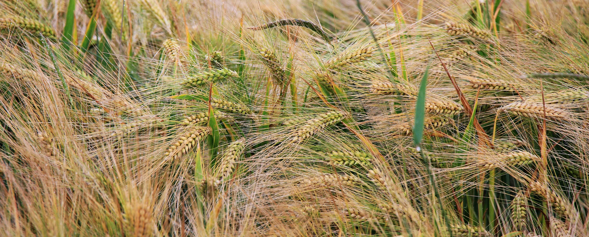

- [Français](#outil-de-moissonage-par-api-ckan)
- [English](#government-of-canada-open-data-portal-harvester)

## Outil de moissonage par API CKAN

Ce répertoire permet d'importer les jeux de données du portail de données ouvertes du gouvernement du Canada (https://open.canada.ca/en/open-data)

Ce script fut concu pour importer les jeux de données dans une version compatible de CKAN tel que défini par l'extension de CKAN de l'Agence spatiale canadienne. [ckanext-csa](https://github.com/asc-csa/ckanext-asc-csa).

Ce script télécharge une copie des métadonnées des jeux de données d'une installation de CKAN donnée, et permettant de les soumettre par la suite à une autre installation de CKAN.

### Démarrage rapide

#### 1.Installer les prérequis avec pip
Installez les prérequis contenus dans requirements.txt à l'aide de la commande pip suivante :
```
pip install -r requirements.txt
```

#### 2. Configurer le script
Dans app.py , remplacez {your_api_key} avec une clé API valide de l'installation CKAN qui recevra les jeux de données. Cette clés est unique à chaque utilisateur de CKAN

Dans app.py,vous devrez fournir l'identifiant (ou le nom) de l'organisation qui chaperonnera ces jeux de données. 

#### 3. Exécution du script
Tout d'abord, il faut s'assurer qu'il y ait un datapusher qui tourne en parallèle avant de démarrer l'outil de moissonage. [Plus d'information sur le datapusher](https://github.com/ckan/datapusher).

Il suffit alors d'exécuter le script app.py à l'aide de la commande ci-dessous. Assurez-vous que les deux serveurs CKAN (receveur et demandeur ) sont tous les deux opérationnel. Dépendant de la capacité des serveurs CKAN, ce script peut prendre quelques minutes à quelques heures.
```
python app.py
```

#### 4. Comportements attendus et erreurs courantes
##### Erreurs courantes
- Le serveur ne fonctionne pas en même temps que le script
- Il pourrait également y avoir des ensembles de données déjà dans CKAN qui partagent le nom
- Erreurs de validation qui devraient apparaître sur la console du serveur CKAN

Ces erreurs signifient que les présélections doivent être modifiées (une liste du fichier contenant toutes les présélections doit être disponible dans le fichier development.ini de ckan sous ckan.presets) ou que la manière dont les données ou le nettoyage doivent être modifiés

- Si le script ne parvient pas à être extrait du site web du gouvernement canadien, il se peut que l'API/URL ait changé ou que le service soit hors service.

Le portail du Canada semble assez instable pour le moment.

##### Comportement attendu
Si tout a été importé correctement dans CKAN, il ne devrait pas y avoir d'erreurs lors de l'examen des logs/alertes qui sont imprimés à partir du terminal dans lequel CKAN a été lancé. Lors de l’ajout, le système ignore les jeux de données existants and lance une exception indiquant qu’il est un conflit. Aucun changement n’est appliqué aux jeux de données existants.

## Government of Canada Open Data Portal Harvester

This repository harvests CSA metadata for datasets from [Government of Canada Open Data Portal](https://open.canada.ca/en/open-data)

Running this script requires that you have extended the scheming of CKAN with the custom scheming implemented in [ckanext-csa](https://github.com/asc-csa/ckanext-asc-csa).

Harvesting in this case means that it takes the data from the GC website and exports that locally where the script is run from, then pushes those datasets to the CKAN instance.

Once harvested it cleans the data to match CSA metadata schema, and then through CKAN's API imports those datasets into CSA CKAN.

Written in Python 2 because Python 3 was not available on the development machine I was using. CKAN is also still using Python 2.

For a closer look on the cleaning process you can download jupyter notebook and open gov_canada_data_clean.ipynb

The more updated and correct code will be in the .py file instead of the .ipynb file. If you are not familiar with jupyter notebooks, you need to install jupyter, navigate to the directory, and then launch jupyter notebook by the command `jupyter notebook`

### Quick Start

#### 1. Install the requirements with pip
Install the requirements from the requirements.txt file
```
pip install -r requirements.txt
```

#### 2. Set the configuration
In app.py replace {your_api_key} with your API key found on your CKAN user profile and replace {ckan_url} with the url of your ckan instance. The current url/IP in the file should work with the default install.

In app.py, you will need to provide the id for your organization. This id can be found by creating an organization in ckan (see ckanext-csa readme) and once on the organization page, clicking the json link and finding the entry next to owner_org. You will then be able to upload dataset under that organisation id

#### 3. Execute the script
First of all, make sure that there is a datapusher running in parallel before starting the harvesting tool. [More information about the datapusher](https://github.com/ckan/datapusher).

Run the script with the command below. Make sure the CKAN server is running when you run this script. The script will take some time to execute all the API requests.
```
python app.py
```

#### 4. Expected Behavior and Common Mistakes
##### Common Mistakes
- The server is not running at the same time as the script
- There could also be datasets already in CKAN that share the name
- Validator errors which should show up the CKAN server console

Those error would means the presets would either need to be change (a list of the file containing all the presets should be available in the development.ini file of ckan under ckan.presets) or that the way the data or cleaned should be changed

- If the script fails to pull from the Gov Canada website it could be that their API/URL changed or that their service is down

The Canada portal seems quite unstable at the moment.

##### Expected Behavior
If everything was imported correctly into CKAN there should be no errors when looking at the logging/alerts that are printed from the terminal which CKAN was started in. Upon import, the system skips all existing datasets and throws a CONFLICT exception for each of them. There is no override nor update in that case.
